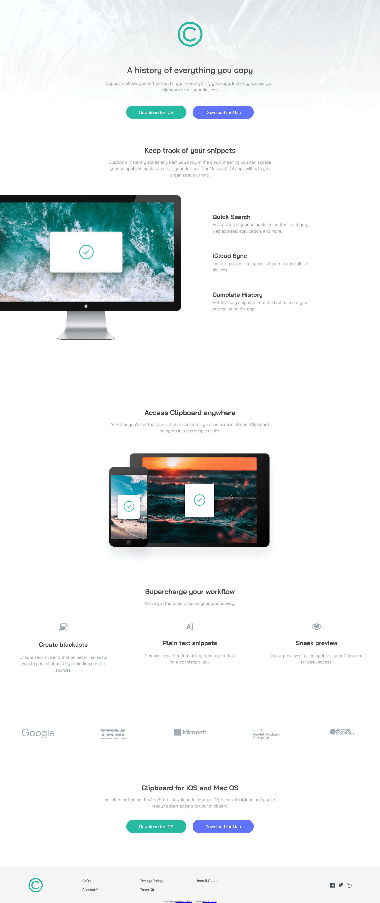
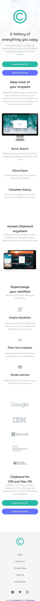

# Frontend Mentor - Clipboard landing page solution

This is a solution to the [Clipboard landing page challenge on Frontend Mentor](https://www.frontendmentor.io/challenges/clipboard-landing-page-5cc9bccd6c4c91111378ecb9).

## Table of contents

- [Overview](#overview)
  - [The challenge](#the-challenge)
  - [Screenshot](#screenshot)
  - [Links](#links)
- [My process](#my-process)
  - [Built with](#built-with)
  - [What I learned](#what-i-learned)
  - [Continued development](#continued-development)
- [Author](#author)

## Overview

### The challenge

Users should be able to:

- View the optimal layout for the site depending on their device's screen size
- See hover states for all interactive elements on the page

### Screenshot

### Links

- Solution URL: [Frontend Mentor Solution](https://www.frontendmentor.io/solutions/responsive-clipboard-landing-page-_jR3eEXMH3)
- Live Site URL: [Live Site](https://blessyoumate.github.io/clipboard-landing-page-fm/)

## My process

### Built with

- Semantic HTML5 markup
- CSS custom properties
- Flexbox
- CSS Grid
- Mobile-first workflow

### What I learned

I realized how challenging it can be to create a layout that works well on both mobile and desktop. When I switched to the desktop view, I often found myself needing extra wrappers or containers to style sections properly and keep everything consistent.

### Continued development

I want to focus more on refining details in future projects. For example, I really struggled with the desktop version of footer in this challenge — I built it in a rather complicated way and still haven’t fully finished it. I plan to look at other people’s solutions to understand how to do it. Also I will try something with JS.

## Author

- GitHub - [Wiktor Jasiak](https://github.com/BlessYouMate)
- Frontend Mentor - [@BlessYouMate](https://www.frontendmentor.io/profile/BlessYouMate)
